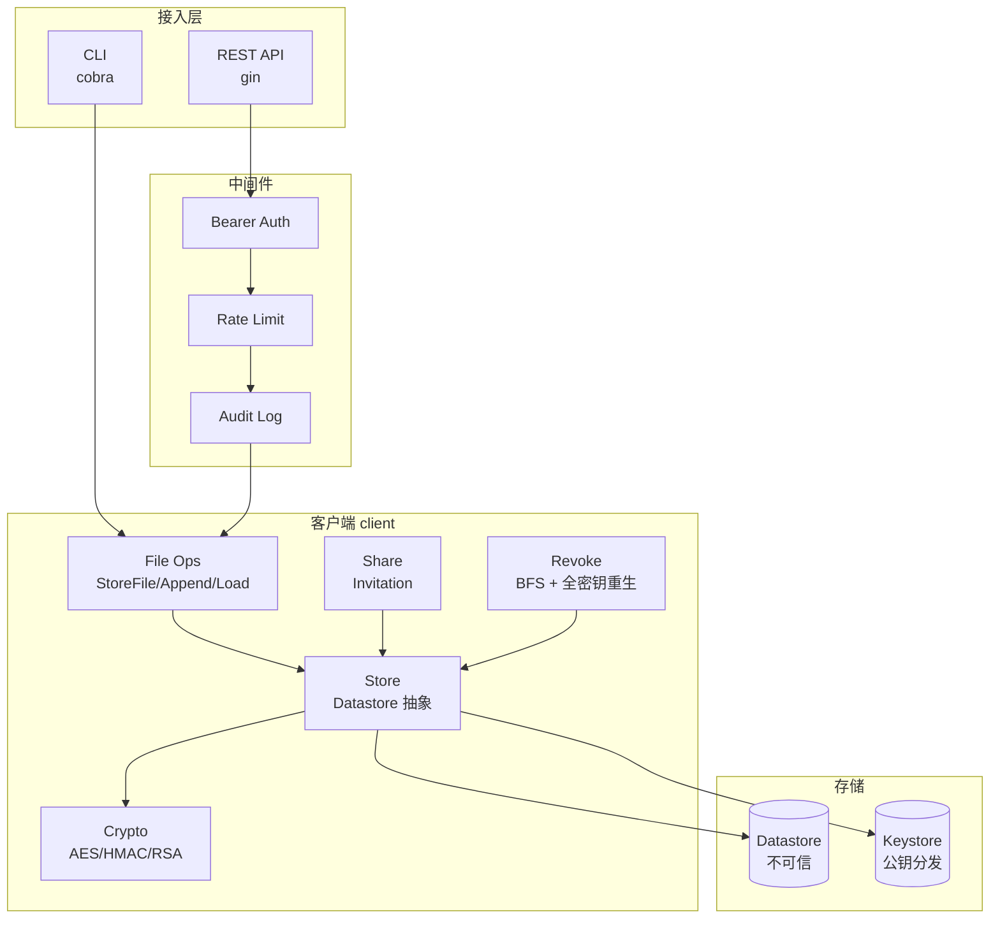

# 加密文件系统（CS161 工程化改造）

> 不可信存储上的端到端加密文件系统，支持文件分块、共享、撤销前向保密、REST API 接入层。
>
> Go · AES-256 + HMAC-SHA256 + RSA-4096 + argon2 · 不可信 Datastore

## 核心特性

- **并发安全**：per-UUID 锁 + stepVersion 乐观锁 + 指数退避，100 并发 0 chunk 丢失，p99 < 20μs（[benchmark](docs/benchmark.md)）
- **前向保密**：BFS 撤销 + 全密钥重生，6 类攻击防御有测试验证（[threat model](docs/threat-model.md)）
- **REST API 接入层**：Bearer 鉴权 + 令牌桶限流 + 审计日志 + 通知服务

## 架构



## Quick Start

### 跑 demo

```bash
./scripts/demo.sh
```

完整流程：init → store → share → accept → append → revoke → 验证前向保密 + 通知 + 审计。

### 起 REST server

```bash
go run ./cmd/cs161-server    # 默认 :8080
PORT=18080 go run ./cmd/cs161-server
```

### 用 CLI

```bash
go run ./cmd/cs161-cli user init --username alice --password pwd123
go run ./cmd/cs161-cli file store --username alice --password pwd123 --filename f.txt --data "hi"
go run ./cmd/cs161-cli file load --username alice --password pwd123 --filename f.txt
```

## 测试

```bash
# 全套测试
go test ./client/ ./cmd/cs161-cli/ ./cmd/cs161-server/

# 并发基准
go test -bench=. -benchmem -run='^$' ./client/

# 威胁模型
go test -run 'TestRevoked|TestReplay|TestChunkSwap|TestMetadataRollback|TestConflated' -v ./client/

# 黑盒（CS161 baseline）
go test ./client_test/
```

测试覆盖：白盒 32 + CLI 7 + REST 29 + 黑盒 38/39（baseline 一致）。

## 文档

- [并发基准](docs/benchmark.md) — 吞吐/冲突率/活性数据
- [威胁模型](docs/threat-model.md) — 6 类攻击防御 + vs Dropbox/学城对比
- [架构对比](docs/architecture-comparison.md) — vs 学城 12.3/12.4 深度对比，模型层权衡
- [面试 QA 准备](docs/interview-qa.md) — 16 个问答 + 反问环节 + 准备优先级
- [long-task-spec-to-pr 复盘](docs/2026-08-18-long-task-retrospective.md) — AI 协作流程复盘 + 4 个面试故事
- [工程化改造报告](docs/2026-08-14-cs161工程化改造/FINAL_REPORT.md) — 9 批次交付记录
- [执行计划](docs/2026-08-14-cs161工程化改造/EXECUTION_PLAN.md) — TDD 接缝设计

## 关键设计决策

### 1. 不可信存储模型

Datastore 任意读写、密文可见。所有安全保证在客户端密码学层：
- 文件分块 AES-256-CTR + HMAC-SHA256
- 元数据独立加密 + HMAC
- chunk HMAC 输入含 UUID（防 chunk swap）

### 2. 撤销前向保密（核心差异化）

`RevokeAccess` 不是删权限条目，而是密码学层彻底重置：
- BFS 递归撤销下游所有用户
- 全密钥重生（fileEncKey / fileHMACKey / metadataEncKey / metadataHMACKey）
- 新 chunk 链表 + 新 metadata UUID
- 旧密钥即使被持有，也无法解新 chunk（HMAC mismatch）

vs Dropbox / 学城：它们服务端持明文，撤销只删权限；本实现存储全部泄露也无法解新数据。

### 3. stepVersion 乐观锁 + per-UUID mutex

- `SaveFileMetadataWithVersion(expectedVersion)` 检测版本冲突
- per-metadataUUID `sync.Mutex` 包住 LoadMeta+SaveChunk+SaveMeta 关键段，串行化同文件 append
- 全局 `datastoreMu` 保护 userlib 非线程安全的 map（已知限制，升级路径：分片锁）

## 已知限制

- in-memory Datastore（`userlib.go` 框架限制），生产需换持久化存储
- 单实例 token store / audit log / notify store（升级路径：Redis / DB / Mafka）
- metadata rollback 在无 WORM 存储上无法完全防御（通过 version audit 缓解）

## 项目结构

```
.
├── client/              # 加密文件系统核心
│   ├── types.go         # 数据结构 + NotifyHook
│   ├── crypto.go        # AES/HMAC/RSA 封装
│   ├── store.go         # Datastore 抽象（线程安全）
│   ├── auth.go          # InitUser/GetUser
│   ├── file_ops.go      # StoreFile/AppendToFile/LoadFile
│   ├── share.go         # CreateInvitation/AcceptInvitation
│   ├── revoke.go        # RevokeAccess（BFS + 全密钥重生）
│   ├── directory.go     # 目录 + 权限继承
│   └── *_test.go        # 白盒测试（含并发基准 + 威胁模型）
├── cmd/
│   ├── cs161-cli/       # CLI（cobra）
│   └── cs161-server/    # REST API（gin + middleware）
├── client_test/         # 黑盒测试（CS161 baseline，不可改）
├── scripts/
│   └── demo.sh          # 端到端 demo
└── docs/
    ├── benchmark.md     # 并发基准
    ├── threat-model.md  # 威胁模型
    └── 2026-08-14-cs161工程化改造/  # 工程化批次记录
```
