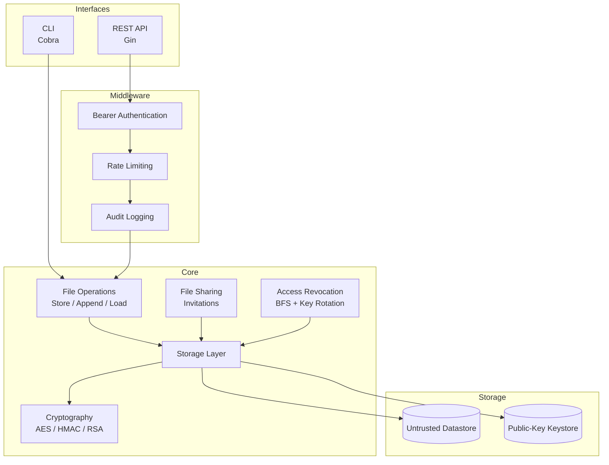

# Security-First File Storage & Sharing System

A secure file-storage and sharing system built in Go for an untrusted storage environment, with encrypted file operations, recursive access revocation, concurrency-safe appends, and a REST API layer.

> Originally based on the secure file-sharing model from UC Berkeley CS161 Project 2, then extended with concurrency control, REST APIs, authentication middleware, rate limiting, auditing, benchmarks, and additional adversarial testing.

**Tech Stack:** Go · Gin · REST APIs · AES-256 · HMAC-SHA256 · RSA-4096 · Argon2 · Concurrent Systems

---

## Highlights

- **Concurrency-safe file appends** — per-file synchronization and metadata version validation preserve chunk-chain consistency with **zero chunk loss across 100 concurrent appends**
- **Secure file sharing and revocation** — recursive BFS revocation with full key rotation prevents revoked users from decrypting future updates
- **REST service layer** — **7 API endpoints** with Bearer authentication, token-bucket rate limiting, audit logging, and notifications
- **Adversarial testing** — automated tests cover replay attacks, chunk substitution, revoked access, cross-file chunk misuse, and metadata rollback behavior
- **Modular Go architecture** — storage, cryptography, authentication, file operations, sharing, and revocation are separated into independently testable components

---

## Architecture


```mermaid
graph TB
    subgraph Interfaces
        CLI[CLI<br/>Cobra]
        REST[REST API<br/>Gin]
    end

    subgraph Middleware
        AUTH[Bearer Authentication]
        RATE[Rate Limiting]
        AUDIT[Audit Logging]
    end

    subgraph Core
        FILEOPS[File Operations<br/>Store / Append / Load]
        SHARE[File Sharing<br/>Invitations]
        REVOKE[Access Revocation<br/>BFS + Key Rotation]
        STORE[Storage Layer]
        CRYPTO[Cryptography<br/>AES / HMAC / RSA]
    end

    subgraph Storage
        DS[(Untrusted Datastore)]
        KS[(Public-Key Keystore)]
    end

    CLI --> FILEOPS
    REST --> AUTH --> RATE --> AUDIT --> FILEOPS

    FILEOPS --> STORE
    SHARE --> STORE
    REVOKE --> STORE

    STORE --> CRYPTO
    STORE --> DS
    STORE --> KS
```

---

## Key Engineering Decisions

### 1. Concurrency-Safe Append Pipeline

Files are represented as linked encrypted chunks. Appending to a file requires updating both the current tail and the file metadata:

```text
Load Metadata
     ↓
Write New Chunk
     ↓
Update Tail Pointer
     ↓
Persist Metadata
```

A naive concurrent implementation allows multiple goroutines to read the same tail pointer and overwrite one another, corrupting the chunk chain.

The system prevents this with:

- a per-metadata UUID mutex around the critical section
- metadata version validation
- retry support with exponential backoff for version conflicts

```go
unlock := lockMetadata(fileMetadataUUID)
defer unlock()

// Load metadata → write chunk → update metadata
// executes atomically for a single file.
```

Concurrency tests verify:

- **100 concurrent appends**
- **0 lost chunks**
- no deadlocks under a 5-second timeout
- no observed starvation in the benchmark workload

Different files can still be processed independently, while appends to the same file are serialized to preserve correctness.

See [`docs/benchmark.md`](docs/benchmark.md) for benchmark details.

---

### 2. Efficient Append-Only Storage

Appending data does not require downloading or rewriting the existing file.

Each file is stored as a linked sequence of encrypted chunks:

```text
Metadata
   │
   ▼
Chunk 1 → Chunk 2 → Chunk 3 → Tail
```

The metadata stores the head and tail pointers, allowing a new chunk to be added directly at the end of the chain.

This design keeps append cost independent of the total file size and avoids full-file rewrites.

---

### 3. Secure Storage over an Untrusted Datastore

The storage layer is assumed to be fully untrusted: an attacker may read, modify, replace, or replay stored objects.

Security guarantees are therefore enforced on the client side.

The system uses:

- **AES-256** for symmetric encryption
- **HMAC-SHA256** for integrity protection
- **RSA-4096** for public-key operations
- **Argon2** for password-derived key material
- independent encryption and integrity keys for file data and metadata

Each encrypted chunk is cryptographically bound to its UUID, preventing an attacker from moving valid ciphertext between storage locations without detection.

---

### 4. Recursive Access Revocation

Sharing relationships form a graph.

For example:

```text
Alice
 ├── Bob
 │    └── Charlie
 └── David
```

If Alice revokes Bob, Charlie must also lose access while David continues to retain access.

`RevokeAccess` therefore:

1. performs BFS over the sharing graph
2. identifies the full downstream revocation set
3. removes revoked users' file references
4. generates new file encryption and HMAC keys
5. creates new encrypted file chunks and metadata
6. updates retained users to the new metadata
7. deletes obsolete storage objects

As a result, users holding old keys cannot decrypt content written after revocation.

---

## REST API Layer

The core storage system is exposed through a Gin-based HTTP service.

The API layer includes:

- **7 REST endpoints**
- Bearer-token authentication
- token-bucket rate limiting
- audit logging
- notification handling
- HTTP-level integration tests

Run the server with:

```bash
go run ./cmd/cs161-server
```

The default port is `8080`.

To use another port:

```bash
PORT=18080 go run ./cmd/cs161-server
```

---

## CLI

A Cobra-based CLI is also available for interacting with the storage layer directly.

Initialize a user:

```bash
go run ./cmd/cs161-cli user init \
  --username alice \
  --password pwd123
```

Store a file:

```bash
go run ./cmd/cs161-cli file store \
  --username alice \
  --password pwd123 \
  --filename f.txt \
  --data "hello"
```

Load a file:

```bash
go run ./cmd/cs161-cli file load \
  --username alice \
  --password pwd123 \
  --filename f.txt
```

---

## End-to-End Demo

Run:

```bash
./scripts/demo.sh
```

The demo exercises the complete workflow:

```text
Initialize User
      ↓
Store File
      ↓
Share File
      ↓
Accept Invitation
      ↓
Append Data
      ↓
Revoke Access
      ↓
Verify Revocation
      ↓
Inspect Notifications / Audit Logs
```

---

## Testing

Run the main test suites:

```bash
go test ./client/ ./cmd/cs161-cli/ ./cmd/cs161-server/
```

### Concurrency Tests and Benchmarks

```bash
go test \
  -run 'TestConcurrentAppend|TestConflictRate' \
  -v ./client/

go test \
  -bench=. \
  -benchmem \
  -run='^$' \
  ./client/
```

### Adversarial / Threat-Model Tests

```bash
go test \
  -run 'TestRevoked|TestReplay|TestChunkSwap|TestMetadataRollback|TestConflated' \
  -v ./client/
```

The threat-model test suite covers:

| Scenario | Expected Behavior |
| --- | --- |
| Revoked user attempts to read new content | Rejected |
| Revoked user reuses old keys | New content cannot be authenticated/decrypted |
| Invitation replay | Rejected |
| Encrypted chunk substitution | Detected |
| Cross-file chunk reuse | Detected |
| Metadata rollback | Version regression is observable; full prevention requires stronger storage guarantees |

See [`docs/threat-model.md`](docs/threat-model.md) for details.

---

## Project Structure

```text
.
├── client/
│   ├── types.go
│   ├── crypto.go
│   ├── store.go
│   ├── auth.go
│   ├── file_ops.go
│   ├── share.go
│   ├── revoke.go
│   ├── directory.go
│   └── *_test.go
│
├── cmd/
│   ├── cs161-cli/
│   └── cs161-server/
│
├── client_test/
│   └── client_test.go
│
├── scripts/
│   └── demo.sh
│
└── docs/
    ├── benchmark.md
    ├── threat-model.md
    ├── architecture-comparison.md
    └── ...
```

### Core Modules

| Module | Responsibility |
| --- | --- |
| `crypto.go` | Encryption, HMAC, key derivation, hybrid encryption |
| `store.go` | Datastore abstraction and metadata persistence |
| `auth.go` | User initialization and authentication |
| `file_ops.go` | Store, append, and load operations |
| `share.go` | File invitations and sharing |
| `revoke.go` | Recursive revocation and key rotation |
| `directory.go` | Directory and permission inheritance |

---

## Known Limitations

This project intentionally documents its current architectural limits.

### In-Memory Datastore

The underlying CS161 datastore implementation is memory-backed and not intended as a production persistence layer.

A production deployment would replace it with a durable database or object store.

### Same-File Writes Are Serialized

Appends to the same file are serialized to preserve the linked-chunk invariant.

This favors correctness over maximizing same-file write throughput.

A production-scale alternative could use independently allocated chunks with compare-and-swap metadata updates.

### Single-Instance Middleware State

Authentication tokens, audit logs, and notification state are currently maintained within a single service instance.

A horizontally scaled deployment would move these components to shared systems such as Redis or a persistent database.

### Metadata Rollback

A fully malicious storage provider can replay an older valid metadata object.

The current version field makes regressions observable, but complete rollback prevention would require an external trusted monotonic counter, append-only log, or WORM-style storage.

---

## Documentation

- [`docs/benchmark.md`](docs/benchmark.md) — concurrency tests and microbenchmarks
- [`docs/threat-model.md`](docs/threat-model.md) — attacker model and adversarial tests
- [`docs/architecture-comparison.md`](docs/architecture-comparison.md) — architectural trade-offs
- [`docs/interview-qa.md`](docs/interview-qa.md) — engineering design discussion
- [`docs/2026-08-14-cs161工程化改造/FINAL_REPORT.md`](docs/2026-08-14-cs161工程化改造/FINAL_REPORT.md) — engineering extension report

---

## What I Learned

This project evolved from a security-focused file-sharing implementation into a broader systems-engineering exercise.

The most important engineering lessons were:

- protecting an individual storage operation is not enough when correctness depends on a multi-step critical section
- concurrency mechanisms should preserve system invariants before optimizing throughput
- cryptographic access revocation requires key lifecycle management, not only authorization checks
- APIs and middleware should remain separate from storage and cryptographic logic
- security and concurrency claims are much more useful when backed by reproducible tests and benchmarks
- documenting architectural limitations is as important as documenting successful behavior
```
